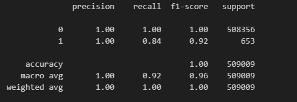
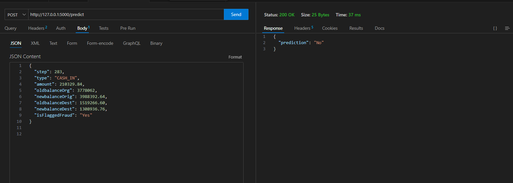

# 💳 Fraud Detection System

A Machine Learning based system that predicts fraudulent financial transactions using transaction behavior and account balance patterns. This project covers the complete ML lifecycle including **EDA, Feature Engineering, Model Training, Evaluation, and Deployment**.

---

## 📌 Project Overview

Fraud detection is critical in digital payment ecosystems. This project aims to:

- Detect fraudulent transactions using ML algorithms
- Perform detailed exploratory data analysis
- Select high-impact predictive features
- Deploy the trained model for real-time prediction

---

---

# 📊 Dataset Description

The dataset contains financial transaction records with the following key fields:

- Transaction Type
- Transaction Amount
- Sender Balance Before Transaction
- Sender Balance After Transaction
- Receiver Balance Before Transaction
- Receiver Balance After Transaction
- Fraud Label (`isFraud`)

---

# 🔍 Exploratory Data Analysis (EDA)

EDA was performed to understand transaction behavior and fraud patterns.

---

## 📈 Fraud vs Non-Fraud Distribution

Understanding class imbalance is important since fraud cases are rare.


---

## 💰 Transaction Type Analysis

Analyzed which transaction types are most associated with fraud.


---

## 📊 Transaction Amount Analysis

Fraudulent transactions often follow different amount distributions compared to legitimate ones.


---
# 🎯 Feature Engineering, Selection & Feature Addition

Feature engineering and selection were critical steps in improving model performance and fraud detection accuracy. The goal was to create meaningful predictors while removing redundant or noisy variables.

---

## 🧩 Feature Engineering (Feature Addition)

New features were created to capture abnormal transaction behaviour that raw features could not directly represent.

### ✅ Added Features

#### 1. `diff_new_old_org`
Represents the difference between the sender's balance before and after the transaction.

diff_new_old_org = oldbalanceOrg - newbalanceOrig


👉 Purpose:
- Helps identify suspicious fund withdrawals
- Fraudulent transactions often leave inconsistent balance changes

---

#### 2. `diff_new_old_dest`
Represents the difference between the receiver's balance before and after the transaction.

diff_new_old_dest = newbalanceDest - oldbalanceDest


👉 Purpose:
- Detects abnormal fund deposits
- Helps identify money laundering patterns

---

### 📌 Why Feature Engineering Was Important

- Captures hidden fraud patterns
- Improves model interpretability
- Enhances prediction accuracy
- Helps detect transaction inconsistencies

---

## 🔎 Feature Selection

Feature selection was performed to retain only the most impactful variables and eliminate redundant information.

---

### 🧪 Selection Techniques Used

#### ✔ Correlation Analysis
- Identified highly correlated variables
- Reduced multicollinearity

#### ✔ Model-Based Importance
- Tree-based models were used to determine feature importance
- Features contributing most to fraud prediction were retained

---

## ⭐ Final Selected Features

The following features were used in the final model:

| Feature | Description |
|----------|-------------|
| `step` | Time step of the transaction |
| `type` | Transaction category |
| `amount` | Transaction amount |
| `oldbalanceOrg` | Sender balance before transaction |
| `oldbalanceDest` | Receiver balance before transaction |
| `diff_new_old_org` | Sender balance difference |
| `diff_new_old_dest` | Receiver balance difference |

---


# 🎯 Feature Engineering & Selection

## Engineered Features

- `diff_new_old_org`
- `diff_new_old_dest`

These capture abnormal balance changes during transactions.

---

## Final Selected Features

- step  
- amount  
- type  
- oldbalanceOrg  
- oldbalanceDest  
- diff_new_old_org  
- diff_new_old_dest  

---

# 🧹 Data Preprocessing

The preprocessing pipeline includes:

- Standard scaling for numeric features
- One-hot encoding for categorical features
- Feature transformation

Saved as:
    preprocessor.pkl

---

# 🤖 Model Building

Multiple ML models were trained and evaluated.

---

# 📊 Model Performance Comparison

| Model | Balanced Accuracy | Precision | Recall | F1 Score |
|----------|-----------------|------------|------------|------------|
| Random Forest | 0.863083 | 0.976000 | 0.726190 | 0.832765 |
| XGBoost | 0.874957 | 0.919708 | 0.750000 | 0.826230 |
| KNN | 0.809481 | 0.904348 | 0.619048 | 0.734982 |
| SVC | 0.764869 | 0.967391 | 0.529762 | 0.684615 |
| Logistic Regression | 0.743993 | 0.854167 | 0.488095 | 0.621212 |
| LightGBM | 0.609234 | 0.141221 | 0.220238 | 0.172093 |

---

## 🏆 Final Model Selection

The **XGBoost and Random Forest models** demonstrated the strongest fraud detection performance based on F1 score and balanced accuracy.

The finalized trained model is saved as:
xgboost as my pc was not able to handle the hypertuning of random forest parameters.

XGBOOSTClassification
---

## 📉 Evaluation Visualizations

### Confusion Matrix




# 🚀 Deployment

The model is deployed using **Flask** for real-time fraud prediction.

---


## 🖥 Deployment Interface



---

# ⚙️ Installation

## 1️⃣ Clone Repository

```bash
git clone <your-repository-link>
cd fraud-detection


